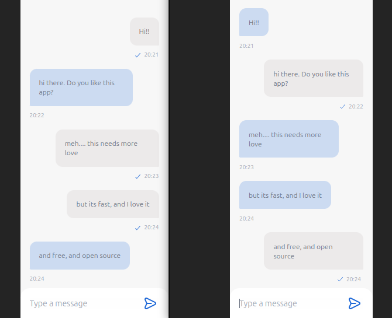

# Chat Client



This is a simple project for creating a chat client using [React UI Chat](https://www.npmjs.com/package/react-ui-chat).
The backend (express + socket.io in NodeJs) for this is provided by [Chat Server](https://github.com/Pep3M/chat-server).

And yes, you can see the chat client in action [here](https://chat-client-ten.vercel.app/).

## Installation

To install the chat client, follow these steps:

1. Clone the repository: `$ git clone https://github.com/Pep3M/chat-client.git`
2. Change into the project directory: `$ cd chat-client`
3. Install the dependencies: `$ npm install`

## Usage

To start the chat client in development, run the following command:
  
```bash 
npm run dev
```

## Contributing

Contributions are always welcome! Please create a PR with your changes.

## License

This project is licensed under the MIT License - see the [LICENSE](LICENSE) file for details.
